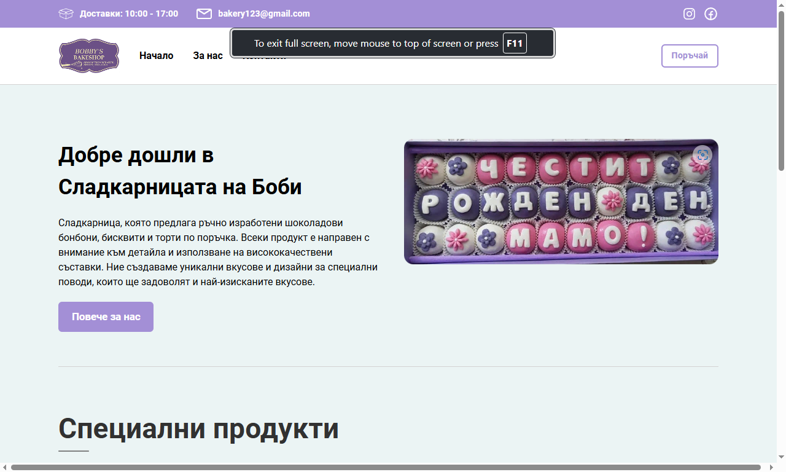
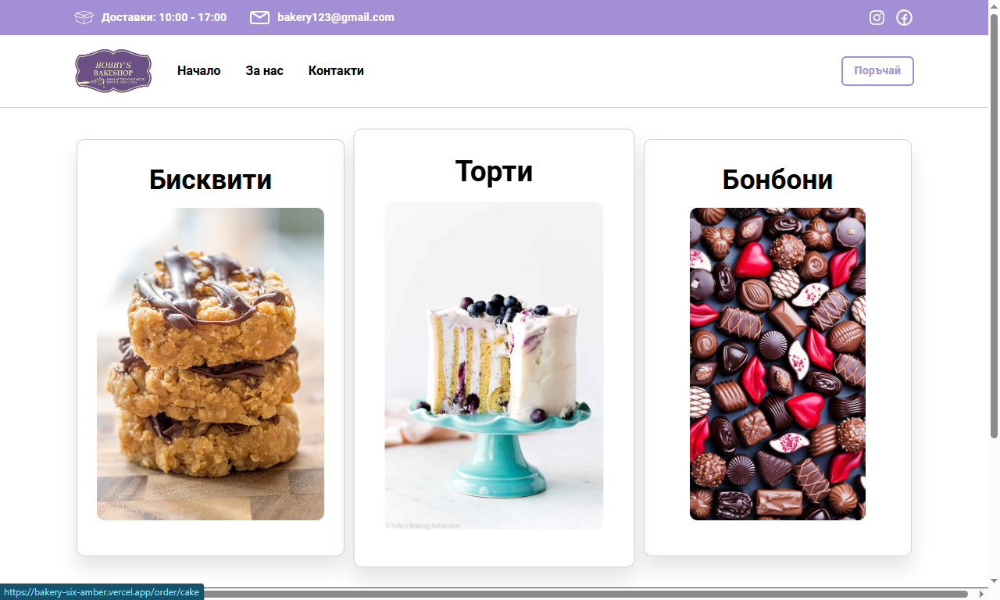
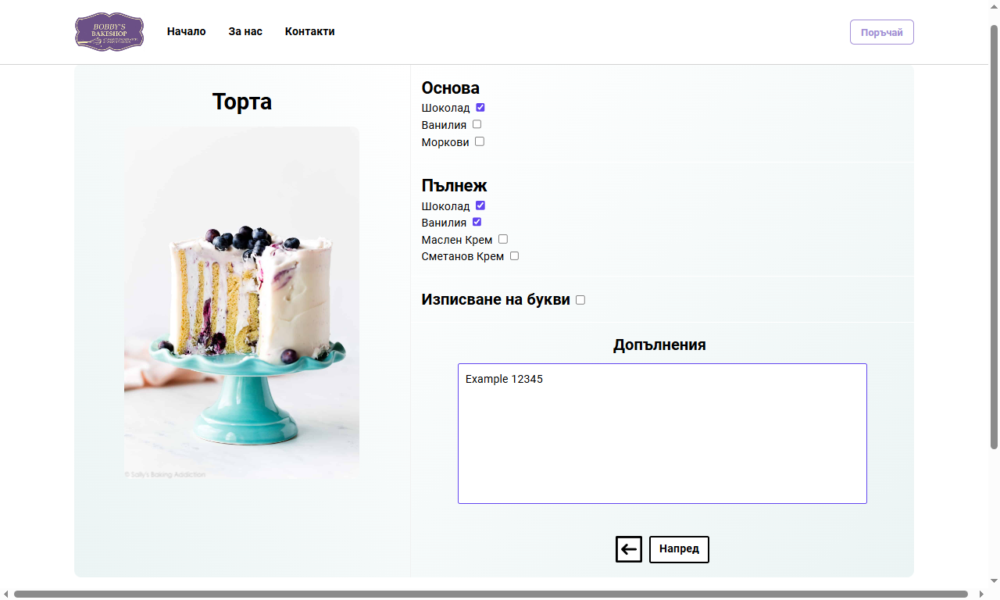
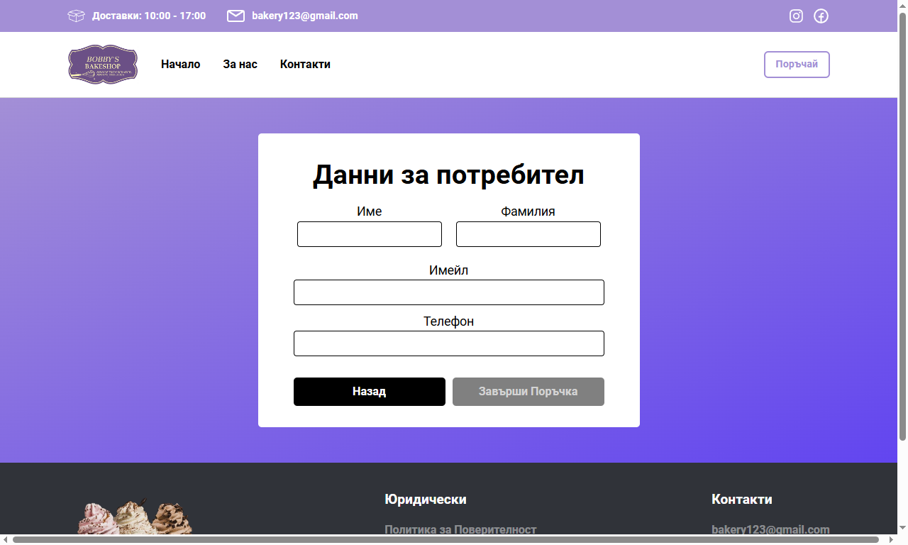
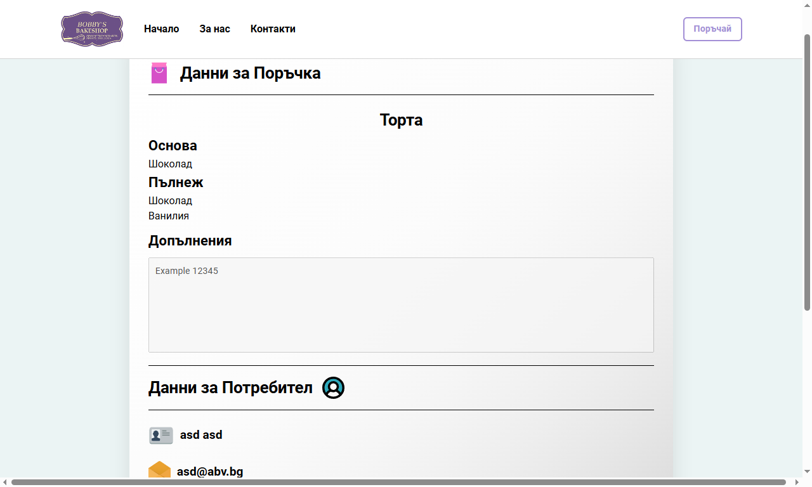
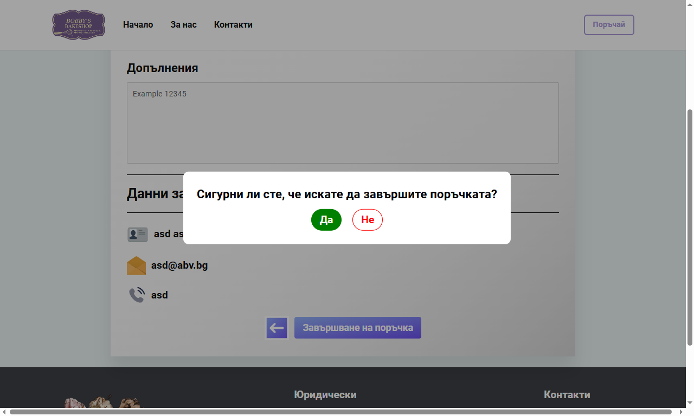
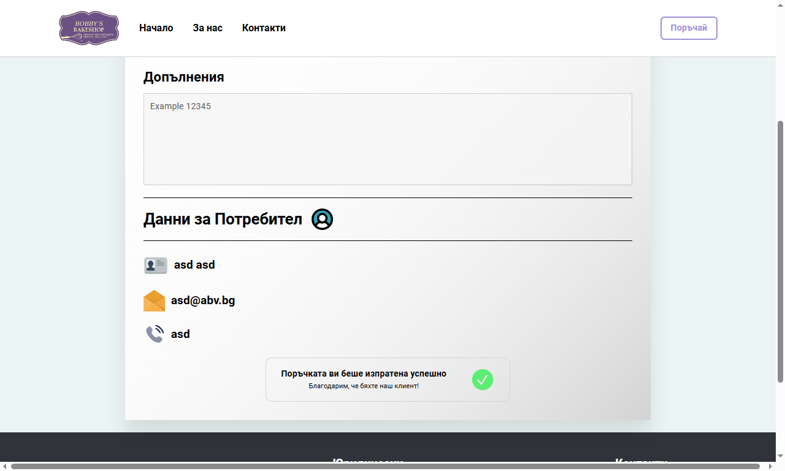

# 🥐[Bobby's Bakery](https://bakery-six-amber.vercel.app)
## [See Live](https://bakery-six-amber.vercel.app)
#### Designed for a local bakery, Bobby's Bakery features a user-friendly front end where customers can browse a variety of baked goods, place orders, and specify preferences. And a well-architected back end allowing secure management of orders.

-----

## Table Of Contents

### Frontend 
  1. [Flow](#flow) 🔄
  3. [Technologies](#technologies) 🔧
  3. [File Structure](#file-structure) 📁
  4. [Error Handling](#error-handling) ⚠️ 
  9. [Styling](#styling) 🎨
  10. [Dependencies](#dependencies) 📦
      
### Backend
  1. [Introduction](#introduction) 🌟
  2. [Project Structure](#project-structure) 📁
  3. [Configuration](#configuration) ⚙️
  4. [Data Management](#data-management) 🛠️
  5. [Endpoints](#endpoints) 🔗
  6. [Testing](#testing) 🧪
  7. [Auth](#auth) 🔒
  8. [Deployment](#deployment) 🚀
     
### Admin
  1. [Purpose](#purpose) 🎯
  2. [What's Next](#whats-next) ⏭️
     
------

# Frontend ↓

-----

## Flow

### *At first, users are greeted with a friendly user interface that gives them the chance to explore services and products.*

-----  

### *After that, they can go to the order page, where they can choose a product*

-----

### *They can filter the order and specify details*

------

### *Users need to input they're non-sensitive data, with optional input of their phone number*

-----

### *Then, they're shown the receipt and have one final confirmation to make*

-----

### *At last, the user is notified about the success of the order transaction*

-----

### Technologies
  The Bakery's frontend was built with the following technologies: 
  - HTML
  - CSS
  - SASS/SCSS
  - JavaScript
  - TypeScript
  - React
-----

### File Structure
components/: Contains all the React components used in the application. Each component has its own directory for better modularization.

- SVGs/: SVG components created with the react-svg library.
- Header/: Contains components related to the header feature.
- Messages/: Components related to messages.
...
contexts/: Contains context providers for managing global state using React's Context API.

hooks/: Custom hooks for reusable logic across the application.

services/: Contains service modules for handling API calls and business logic.

utils/: Utility functions and helpers.

-----

### Error Handling
  **Error handling is done using react-router's `useNavigate` hook, allowing conditional navigation to error pages.**  
  **There's also an `<ErrorBoundary  />` component acting as a middleware for synchronous exceptions**

-----

### Styling
  - **Styling is done utilizing SCSS, a CSS preprocessor.**
  - **`styles_partials` folder, containing scss 'modules' for reusable and dynamic scss code, just like the style of react applications.**
-----

### Dependencies
  **Production - The project does not depend on any external packages apart from `react` and `react-router`.**   
  **Development:**   
      - `TypeScript` & `EsLint`  
      - `SASS`  
      - `Vite`  
      - Respective `react` packages
      
-----

# Frontend ↑
# Backend  ↓ 
-----

### Introduction

-----

### Project Structure
The project is organized into several directories, each serving a specific purpose:

- **Models**
  - DTOs: Contains Data Transfer Objects used for transferring data between layers.
  - Entities: Holds the entity classes that map to database tables.
  - Helpers: Utility classes and methods to support various functionalities.
- **Services.Tests**
  - Contains unit tests for the services to ensure functionality and reliability.
- **Services**
  - Data/DbContexts: Manages database contexts and entity configurations.
  - Repositories: Implements data access logic for various entities.
  - Services: Contains business logic and service implementations.
  - Validation: Includes validation logic for entities and data transfer objects.
- **WebApi**
  - Controllers: Handles HTTP requests and responses.
  - Migrations: Manages database migrations and schema changes.
  - Properties: Contains configuration files for the Web API project.
------

### Configuration
Configuration for Bobby's Bakery backend is managed using **Azure Environment Variables** and `Microsoft.Extensions.Configuration`. This allows for secure and flexible configuration management across different environments.

-----

### Data Management
Data management is handled through the Services layer, which includes Data/DbContexts, Repositories, and Validation. The backend uses a `PostgreSQL` database hosted on Azure for data storage. Utilizing `Entity Framework Core` and a dynamic `EntityService` class, as well as a dynamic `EntityControllerBase` class, data management is often done seamlessy because of the abstraction.

-----

### Endpoints
You can find more information about the API's endpoints <a href="./readme_assets/Endpoints.md">here</a>

------

### Testing
Testing is implemented using `xUnit`. The `Services.Tests` directory contains all the unit tests to ensure the reliability and correctness of the services provided by the backend.

-----

### Auth
Authentication is done using JWT (JSON Web Tokens). Authentication is required only for the admin panel, ensuring that administrative actions are secured.

----

-----

### Deployment
The backend for Bobby's Bakery is deployed on Azure, utilizing Azure's cloud infrastructure for scalability and reliability. The database used is PostgreSQL, also hosted on Azure.

-----
# Backend  ↑ 
# Admin ↓ 

-----

### Purpose
The Admin Page is designed to provide a centralized platform for managing and overseeing various aspects of the system. It allows administrators to perform essential tasks such as user management, content moderation, system monitoring, and configuration settings. The goal is to streamline administrative processes, enhance efficiency, and ensure the smooth operation of the system.

-----

### What's next?
The next steps for the Admin Page include completing the development of remaining features and conducting thorough testing. Future enhancements will focus on improving the user interface, adding advanced analytics, and integrating additional administrative tools to further empower administrators and improve system management capabilities.

------
